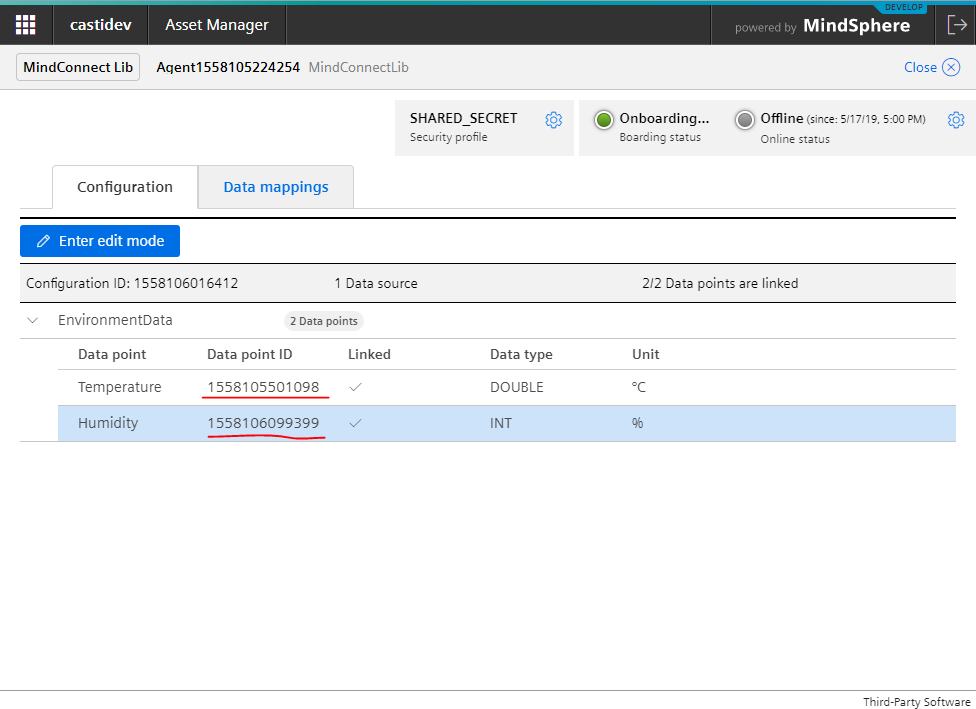
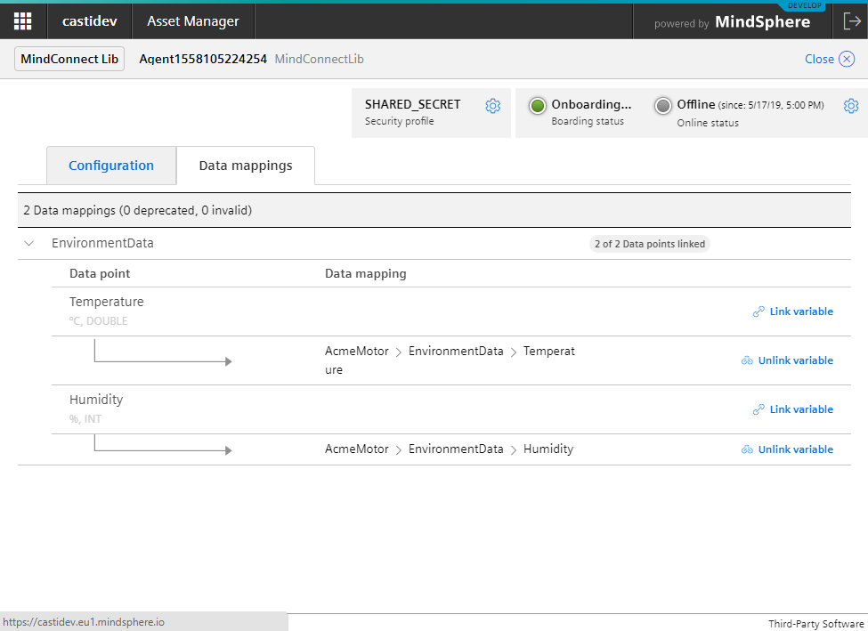

# Mindconnect-NodeJS - Agent Development - <small>Starter Projects</small>

## Introduction

The easiest way to start the development is to use the CLI to generate the starter projects

## Prerequisites

You will need the service credentials and the [installed CLI](../cli/setting-up-the-cli.md). 

## Step 1 - Create the project with help of the CLI


### Example

Use the CLI to setup a starter project called my-agent:

```bash 
mc createts --dir my-agent
```

This will provide following output:

```text
Starter project in my-agent has been created.
Please run npm install in my-agent directory to install dependecies.
```

```bash
# after this we will install the required dependencies

 cd my-agent
 npm install 
```

This should be the result of the installation

``` text
npm notice created a lockfile as package-lock.json. You should commit this file.
npm WARN mc-agent-ts@1.0.0 No repository field.
npm WARN mc-agent-ts@1.0.0 license should be a valid SPDX license expression

added 69 packages from 132 contributors and audited 88 packages in 24.888s
found 0 vulnerabilities
```

After this  create the agentconfig.json with help of the CLI:

```bash
 mc create-agent --passkey{your passkey} --config agentconfig.json
```

This will produce following output

```text
Configure your agent at:

        https://{yourtenant}-assetmanager.eu1.mindsphere.io/entity/{agentid}/plugin/uipluginassetmanagermclib
```


## Step 2 - Configuring the agent

Click on the link provided by the CLI and configure the agent in the MindSphere.



Link the variables to an asset:




## Step 3 - Change the IDs to your Datapoint Ids and start the agent:

```typescript

import { DataPointValue, MindConnectAgent, MindsphereStandardEvent, retry, TimeStampedDataPoint } from "@mindconnect/mindconnect-nodejs";

(async function () {

    const sleep = (ms: any) => new Promise(resolve => setTimeout(resolve, ms));
    const configuration = require("./agentconfig.json");
    const agent = new MindConnectAgent(configuration);
    const log = (text: any) => { console.log(`[{new Date().toISOString()}] {text.toString()}`); };
    const RETRYTIMES = 5; // retry the operation before giving up and throwing exception

    for (let index = 0; index < 5; index++) {
        try {

            log(`Iteration : {index}`);
            // onboarding the agent
            if (!agent.IsOnBoarded()) {
                // wrapping the call in the retry function makes the agent a bit more resilliant
                // if you don't want to retry the operations you can always just call await agent.OnBoard(); instaead.
                await retry(RETRYTIMES, () => agent.OnBoard());
                log("Agent onboarded");
            }

            if (!agent.HasDataSourceConfiguration()) {
                await retry(RETRYTIMES, () => agent.GetDataSourceConfiguration());
                log("Configuration aquired");
            }

            const values: DataPointValue[] = [
                { "dataPointId": "1558105501098", "qualityCode": "0", "value": (Math.sin(index) * (20 + index % 2) + 25).toString() },
                { "dataPointId": "1558106099399", "qualityCode": "0", "value": ((index + 30) % 100).toString() }
                
            ];

            // same like above, you can also just call  await agent.PostData(values) if you don't want to retry the operation
            // this is how to send the data with specific timestamp
            // await agent.PostData(values, new Date(Date.now() - 86400 * 1000));

            await retry(RETRYTIMES, () => agent.PostData(values));
            log("Data posted");
            await sleep(1000);

            const event: MindsphereStandardEvent = {
                "entityId": agent.ClientId(), // use assetid if you want to send event somewhere else :)
                "sourceType": "Event",
                "sourceId": "application",
                "source": "Meowz",
                "severity": 20, // 0-99 : 20:error, 30:warning, 40: information
                "timestamp": new Date().toISOString(),
                "description": "Test"
            };

            // send event with current timestamp; you can also just call agent.PostEvent(event) if you don't want to retry the operation
            await retry(RETRYTIMES, () => agent.PostEvent(event));
            log("event posted");
            await sleep(1000);

            // upload file
            // the upload-file can be a multipart operation and therefore can be configured to
            // retry the upload of the chunks instead the upload of the whole file.
            // if you don't specify the type , the mimetype is automatically determined by the library
            await agent.UploadFile(agent.ClientId(), "custom/mindsphere/path/package.json", "package.json", {
                retry: RETRYTIMES,
                description: "File uploaded with MindConnect-NodeJS Library",
                chunk: true // the chunk parameter activates multipart upload
            });

            const yesterday = new Date();
            yesterday.setDate(yesterday.getDate() - 1);
            const bulk: TimeStampedDataPoint[] =
                [{
                    "timestamp": yesterday.toISOString(),
                    "values":
                        [{ "dataPointId": "1558106099399", "qualityCode": "0", "value": "10" },
                        { "dataPointId": "1558105501098", "qualityCode": "0", "value": "10" }]
                },
                {
                    "timestamp": new Date().toISOString(),
                    "values": [{ "dataPointId": "1558106099399", "qualityCode": "0", "value": "10" },
                    { "dataPointId": "1558105501098", "qualityCode": "0", "value": "10" }]
                }];

            await retry(RETRYTIMES, () => agent.BulkPostData(bulk));
            log("bulk data uploaded");
            await sleep(1000);

        } catch (err) {
            // add proper error handling (e.g. store data somewhere, retry later etc. )
            console.error(err);
        }
    }
})();

```

## Start the agent

```bash
 npm start
```

This should produce the output like this:

```bash                                                 
> mc-agent-ts@1.0.0 start C:\git\my-agent        
> tsc && node index.js                           
                                                 
[2019-05-17T15:41:11.375Z] Iteration : 0         
[2019-05-17T15:41:13.495Z] Agent onboarded       
[2019-05-17T15:41:14.398Z] Configuration aquired 
[2019-05-17T15:41:14.958Z] Data posted           
[2019-05-17T15:41:16.409Z] event posted          
[2019-05-17T15:41:18.285Z] bulk data uploaded    
[2019-05-17T15:41:19.288Z] Iteration : 1         
[2019-05-17T15:41:19.716Z] Data posted           
[2019-05-17T15:41:21.325Z] event posted          
[2019-05-17T15:41:23.445Z] bulk data uploaded    
[2019-05-17T15:41:24.447Z] Iteration : 2         
[2019-05-17T15:41:24.886Z] Data posted           
[2019-05-17T15:41:26.289Z] event posted          
[2019-05-17T15:41:30.744Z] bulk data uploaded    
```